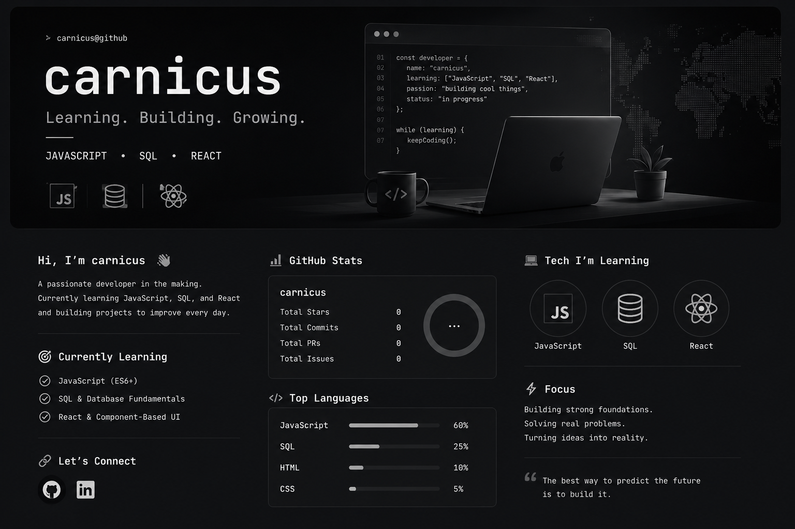

# Hi 👋

```js
const carnicus = {
  learning: ["JavaScript", "SQL", "React"],
  focus: "Building projects and improving every day",
  status: "Always learning"
}
```

## 🚀 Currently Learning
- JavaScript (ES6+)
- SQL & Databases
- React
- Frontend Development

## 🛠 Current Goal
Building clean modern projects and growing as a developer.

## 📈 GitHub Stats
Coming soon...

## ⚡ Fun Fact
I enjoy turning ideas into real projects.
